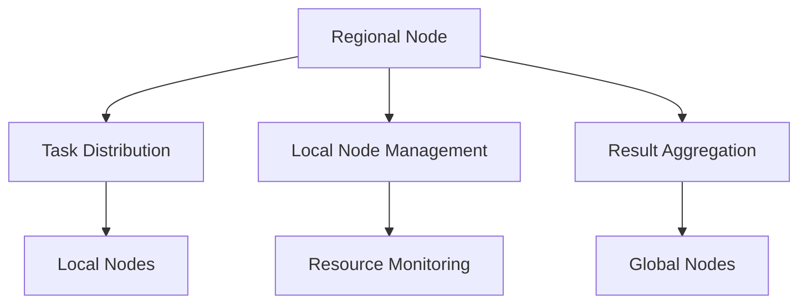

# Tenzro Regional Node

A regional node for the Tenzro Network, responsible for managing local nodes, aggregating computations, and coordinating with global nodes.

## Features

- Regional task coordination and aggregation
- Local node management and task distribution
- Network state aggregation
- Task validation and result verification
- Resource utilization monitoring
- Regional peer discovery and DHT participation

## Prerequisites

- Node.js 18.x
- npm 10.x
- Docker (for containerized deployment)
- Heroku CLI (for Heroku deployment)

## Installation

```bash
# Clone the repository
git clone https://github.com/tenzro/regional-node.git
cd regional-node

# Install dependencies
npm install

# Copy environment file and configure
cp .env.example .env

# Build the project
npm run build
```

## Configuration

Edit `.env` file with your settings:

```env
# Node Configuration
NODE_ENV=production
NODE_TYPE=regional_node
NODE_TIER=aggregator
REGION=us-east
TOKEN_BALANCE=5000

# Network Configuration
DHT_ENABLED=true
DHT_REFRESH_INTERVAL=60000
METRICS_UPDATE_INTERVAL=15000
HEALTH_CHECK_INTERVAL=30000
BOOTSTRAP_NODES=  # URLs of global nodes

# Resource Limits
MAX_CONCURRENT_TASKS=50
TASK_TIMEOUT=1800
```

## Running

### Development Mode

```bash
# Start with hot reloading
npm run dev

# Run tests
npm test

# Run linting
npm run lint
```

### Production Mode

```bash
# Build and start
npm run build
npm start
```

### Docker Deployment

```bash
# Build image
docker build -t tenzro-regional-node .

# Run container
docker-compose up -d
```

### Heroku Deployment

```bash
# Login to Heroku
heroku login

# Create Heroku app
heroku create tenzro-regional-node-[region]

# Configure environment
heroku config:set \
    NODE_ENV=production \
    NODE_TYPE=regional_node \
    NODE_TIER=aggregator \
    REGION=[region] \
    -a tenzro-regional-node-[region]

# Deploy
git push heroku main
```

## API Endpoints

### Node Management

- `GET /health` - Node health status
- `GET /status` - Node status and metrics
- `GET /api/network/state` - Regional network state

### Local Node Management

- `GET /api/nodes/local` - List connected local nodes
- `GET /api/nodes/metrics` - Node performance metrics

### Task Management

- `POST /api/tasks/distribute` - Distribute task to local nodes
- `GET /api/tasks/:taskId` - Get task status
- `GET /api/tasks/aggregate/:taskId` - Get aggregated results

## Architecture



### Components

- **Regional Node Manager**: Coordinates local operations
- **Task Distributor**: Manages task assignment
- **Result Aggregator**: Combines local node results
- **Network Monitor**: Tracks local node health
- **Resource Manager**: Monitors resource utilization
- **Metrics Collector**: Gathers performance data

## Monitoring & Logging

- Health checks every 30 seconds
- Metrics updated every 15 seconds
- Resource utilization monitoring
- Performance metric aggregation

## Security

- TLS encryption for all communications
- Node authentication
- Rate limiting on API endpoints
- DDoS protection through Heroku

## Contributing

1. Fork the repository
2. Create feature branch: `git checkout -b feature/amazing-feature`
3. Commit changes: `git commit -m 'Add amazing feature'`
4. Push to branch: `git push origin feature/amazing-feature`
5. Open Pull Request

## Testing

```bash
# Run unit tests
npm test

# Run integration tests
npm run test:integration

# Run all tests with coverage
npm run test:coverage
```

## Deployment Considerations

1. **Resource Requirements**:
   - Minimum 1 CPU core
   - 2GB RAM
   - 10GB storage

2. **Network Requirements**:
   - Public IP address
   - Open ports: 8080 (HTTP), 8081 (P2P)
   - Stable connection to global nodes

3. **Scaling**:
   - Horizontal scaling through Heroku dynos
   - Auto-scaling based on local node count
   - Regional redundancy recommended

## Troubleshooting

Common issues and solutions:

1. **Global Node Connection Issues**:
   ```bash
   # Check bootstrap configuration
   curl http://localhost:8080/status
   # View connection logs
   tail -f logs/network.log
   ```

2. **Local Node Management Issues**:
   ```bash
   # Check local node connections
   curl http://localhost:8080/api/nodes/local
   # View local node metrics
   curl http://localhost:8080/api/nodes/metrics
   ```

## License

Licensed under the Apache 2.0 License - see the [LICENSE](LICENSE) file for details.

## Contact

- Website: https://tenzro.org
- GitHub: https://github.com/tenzro
- X: https://x.com/tenzr0